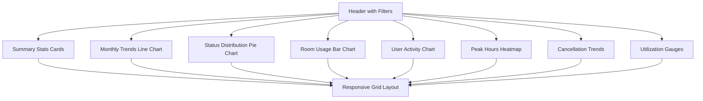

# Enhanced Admin Analytics Page Design Specification

## Overview
This specification outlines a redesigned admin analytics page that transforms the current table-based layout into an interactive, chart-driven dashboard. The new design emphasizes visual appeal, interactivity, and comprehensive data insights while maintaining responsive design principles.

## Current State Analysis
The existing analytics page displays data using:
- **Monthly Trends**: Simple HTML table showing booking counts per month
- **Status Distribution**: Colored list items with status names and counts
- **Room Usage**: Table displaying room names, booking counts, and capacities
- **Summary Stats**: Four metric cards with icons and gradient backgrounds

## Proposed Layout Structure

### Overall Layout
```
┌─────────────────────────────────────────────────┐
│ Header with Filters & Controls                  │
├─────────────────┬───────────────────────────────┤
│ Summary Stats   │ Monthly Trends Line Chart     │
│ (4 cards)       │                               │
├─────────────────┼───────────────────────────────┤
│ Status          │ Room Usage Bar Chart          │
│ Distribution    │                               │
│ Pie Chart       │                               │
├─────────────────┴───────────────────────────────┤
│ Additional Metrics & Charts                     │
│ (User Activity, Peak Hours, etc.)               │
└─────────────────────────────────────────────────┘
```

### Grid System
- **Desktop (≥1200px)**: 4-column grid with flexible card sizing
- **Tablet (768px-1199px)**: 2-column grid
- **Mobile (<768px)**: Single column stack

### Card Structure
Each chart section uses consistent card design:
- Header with title, icon, and description
- Content area with chart and controls
- Footer with additional metadata or actions

## Chart Types and Data Mapping

### 1. Monthly Trends
- **Chart Type**: Interactive line chart with area fill
- **Data**: Monthly booking counts over 12 months
- **Features**: Trend line, data points, smooth curves
- **Library**: Chart.js or Recharts for React

### 2. Status Distribution
- **Chart Type**: Donut chart with legend
- **Data**: Booking status breakdown (Approved, Pending, Rejected, Cancelled, Completed)
- **Features**: Percentage labels, color-coded segments
- **Interactive**: Hover to highlight segment

### 3. Room Usage
- **Chart Type**: Horizontal bar chart
- **Data**: Booking counts per room, with capacity indicators
- **Features**: Bars showing utilization, capacity lines
- **Interactive**: Click bars for room details

### 4. Summary Statistics
- **Display**: Enhanced metric cards with mini-charts
- **Metrics**: Total bookings, approved, pending, rejected
- **Features**: Trend indicators, percentage changes

## Interactive Features

### Tooltips & Hover Effects
- **Charts**: Detailed tooltips showing exact values, percentages, and context
- **Cards**: Hover animations with subtle scaling and shadow effects
- **Data Points**: Highlight on hover with crosshair lines

### Filters & Controls
- **Date Range Picker**: Select custom date ranges for all charts
- **Room Selection**: Multi-select dropdown to filter by specific rooms
- **Status Filter**: Toggle visibility of different booking statuses
- **Time Granularity**: Switch between daily, weekly, monthly views

### Drill-Down Capabilities
- **Chart Elements**: Click on bars/pie segments to view detailed breakdowns
- **Modal Details**: Pop-up modals showing filtered data tables
- **Navigation**: Links to related admin pages (room management, user details)

## Additional Charts and Metrics

### 1. User Activity Chart
- **Type**: Stacked area chart
- **Data**: Daily active users, new registrations, booking activity
- **Purpose**: Track user engagement over time

### 2. Peak Hours Analysis
- **Type**: Heatmap or bar chart
- **Data**: Booking frequency by hour of day and day of week
- **Purpose**: Identify usage patterns and optimize scheduling

### 3. Cancellation Rate Trends
- **Type**: Line chart with dual axes
- **Data**: Cancellation rates over time, compared to total bookings
- **Purpose**: Monitor booking reliability and user satisfaction

### 4. Room Utilization Percentage
- **Type**: Gauge charts or progress bars
- **Data**: Percentage of capacity utilized per room
- **Purpose**: Quick visual indicator of room efficiency

## Responsive Design Considerations

### Breakpoints
- **Mobile (<768px)**:
  - Single column layout
  - Collapsible filter panel
  - Simplified chart interactions
  - Touch-friendly controls

- **Tablet (768px-1199px)**:
  - 2-column grid
  - Condensed headers
  - Optimized chart sizes

- **Desktop (≥1200px)**:
  - 4-column grid
  - Full feature set
  - Advanced interactions

### Performance Optimizations
- Lazy loading for charts
- Data pagination for large datasets
- Caching strategies for repeated queries

## Visual Enhancements

### Color Scheme
- **Primary**: Blue gradient (from-blue-500 to-cyan-400)
- **Secondary**: Purple accent for highlights
- **Status Colors**:
  - Approved: Green (#10B981)
  - Pending: Yellow (#F59E0B)
  - Rejected: Red (#EF4444)
  - Cancelled: Gray (#6B7280)
  - Completed: Blue (#3B82F6)

### Animations
- **Page Load**: Staggered fade-in animations for cards
- **Chart Rendering**: Smooth drawing animations
- **Interactions**: Micro-animations for hover states
- **Transitions**: Smooth state changes between filtered views

### Icons & Typography
- **Icons**: Lucide React icons for consistency
- **Typography**: Gradient text for headers, clear hierarchy
- **Spacing**: Generous padding and margins for breathing room

### Dark Mode Support
- **Charts**: Automatic color adaptation
- **Backgrounds**: Dark gradient themes
- **Text**: High contrast ratios

## Implementation Considerations

### Technology Stack
- **Charts**: Chart.js, D3.js, or Recharts
- **UI Components**: Existing shadcn/ui components
- **State Management**: React hooks with context
- **Data Fetching**: Existing API hooks with caching

### Accessibility
- **Keyboard Navigation**: Full keyboard support for all interactions
- **Screen Readers**: Proper ARIA labels and descriptions
- **Color Contrast**: WCAG AA compliance
- **Focus Indicators**: Clear focus states

### Performance Metrics
- **Load Time**: <2 seconds for initial render
- **Interaction Response**: <100ms for filter changes
- **Memory Usage**: Optimized for large datasets

## Mermaid Diagram: Layout Flow



This design specification provides a comprehensive blueprint for transforming the analytics page into a modern, interactive dashboard that enhances data visualization and user experience.