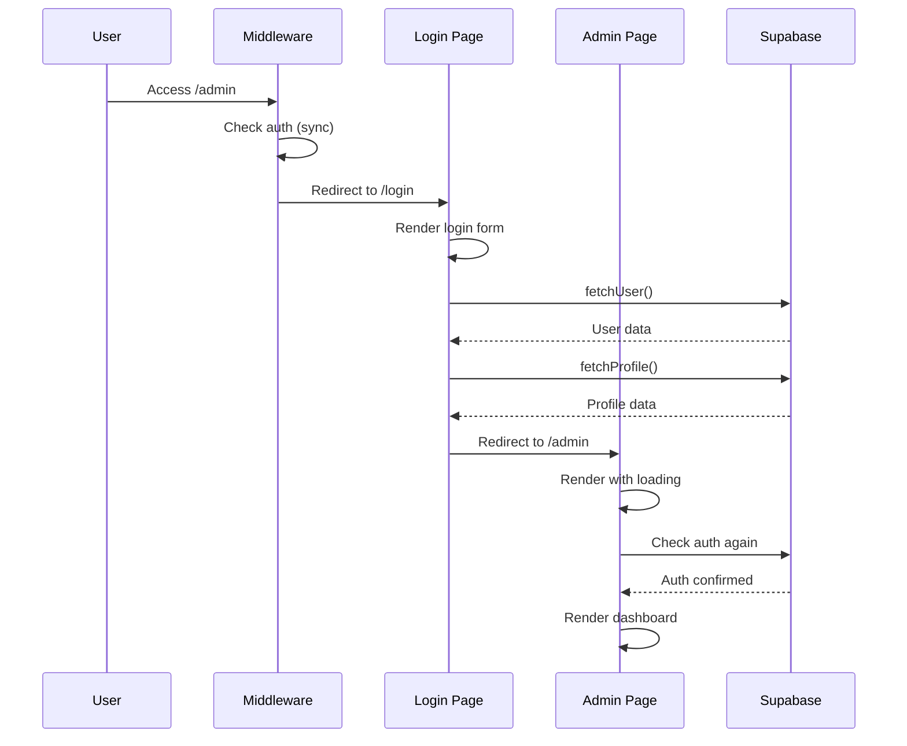
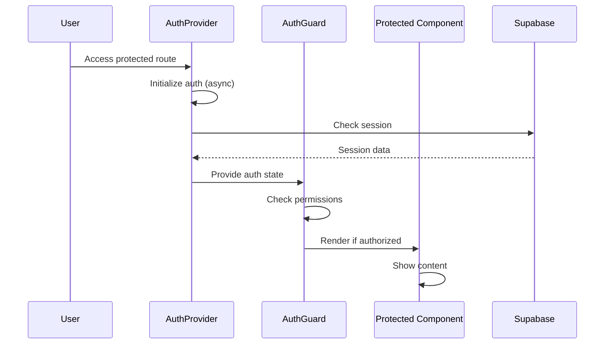

# Unified Authentication Flow Refactor Specification

## Document Information
- **Title:** Unified Authentication Flow Refactor
- **Version:** 1.0.0
- **Date:** 2025-10-29
- **Authors:** Kilo Code Architect
- **Status:** Draft

## Executive Summary

This specification outlines the refactor of the authentication system from a fragmented server-client architecture to a unified, client-side focused authentication flow. The primary goal is to eliminate the "flash to login" issue while improving overall authentication UX and maintainability.

## Current State Analysis

### Current Authentication Flow Analysis

#### 1. Initial Application Load Sequence
```
1. User accesses any URL (e.g., /admin)
2. Next.js server processes request
3. middleware.ts executes (server-side)
4. AuthInitializer component mounts (client-side)
5. useAuth hook initializes
6. Page components render with auth checks
```

#### 2. Middleware Authentication Check (middleware.ts)
```typescript
// Server-side synchronous auth check
export async function middleware(request: NextRequest) {
  const supabase = createServerClient(url, key, {
    cookies: {
      getAll() { return request.cookies.getAll() },
      setAll(cookies) { /* set cookies */ }
    }
  })
  const { data: { user } } = await supabase.auth.getUser()

  // Protected routes check
  if (!user && isProtectedRoute(request.nextUrl.pathname)) {
    console.log(`Middleware: Redirecting to /login from ${request.nextUrl.pathname}`)
    return NextResponse.redirect(new URL('/login', request.url))
  }

  return supabaseResponse
}
```

**Problems:**
- Synchronous blocking operation
- No loading state shown to user
- Immediate redirect without client state consideration
- Uses server-side Supabase client with cookie extraction

#### 3. Client-Side Auth Initialization (AuthInitializer.tsx)
```typescript
// src/components/AuthInitializer.tsx
export default function AuthInitializer() {
  // This component only calls useAuth() hook
  useAuth()
  return null
}
```

#### 4. Auth Store State Management (authStore.ts)
```typescript
// Zustand store with async initialization
const useAuthStore = create<AuthState>((set, get) => ({
  user: null,
  profile: null,
  isLoading: false, // Starts as false, not loading

  fetchUser: async () => {
    set({ isLoading: true })
    const { data: { user } } = await supabase.auth.getUser()
    console.log(`AuthStore: fetchUser, user=${user ? user.id : 'null'}`)
    set({ user, isLoading: false })
    if (user) {
      await get().fetchProfile()
    }
  },

  fetchProfile: async () => {
    const { user } = get()
    if (!user) return

    const { data: profileData, error } = await supabase
      .from('profiles')
      .select('*')
      .eq('id', user.id)
      .single()

    if (error && error.code !== 'PGRST116') {
      console.error('Error fetching profile:', error)
    } else if (profileData) {
      set({ profile: profileData })
    }
  }
}))
```

**Problems:**
- `isLoading` starts as `false`, not `true`
- No `isInitialized` flag to track completion
- Manual `fetchUser()` call required
- No automatic initialization on mount

#### 5. useAuth Hook (useAuth.ts)
```typescript
// Current useAuth hook
export function useAuth() {
  const {
    user,
    profile,
    isLoading,
    login,
    logout,
    fetchUser: storeFetchUser
  } = useAuthStore()

  // Auto-fetch user only if no user exists
  useEffect(() => {
    if (!user) {
      storeFetchUser()
    }
  }, [storeFetchUser, user])

  // Computed properties
  const isAuthenticated = !!user
  const isAdmin = profile?.role === 'admin'
  const userRole = profile?.role || null

  return {
    user,
    profile,
    isLoading,
    isAuthenticated,
    isAdmin,
    userRole,
    login,
    logout,
    fetchUser: storeFetchUser
  }
}
```

**Problems:**
- No `isInitialized` state
- Race condition between middleware redirect and client initialization
- Multiple `fetchUser` calls possible

#### 6. Login Page Authentication Logic (login/page.tsx)
```typescript
// Login page redirect logic
useEffect(() => {
  console.log('Login page: user state changed', { hasUser: !!user, userId: user?.id })

  if (user && !isRedirecting) {
    // Check if email is confirmed
    if (!user.email_confirmed_at) {
      console.log('Login page: email not confirmed, redirecting to confirm')
      setIsRedirecting(true)
      router.push(`/confirm?email=${encodeURIComponent(user.email ?? '')}`)
      return
    }

    const checkRoleAndRedirect = async () => {
      console.log('Login page: checking user role for redirect', { userId: user.id })
      setIsRedirecting(true)

      try {
        const { data: profile } = await supabase
          .from('profiles')
          .select('role')
          .eq('id', user.id)
          .single()

        // Redirect based on role
        const redirectPath = profile?.role === 'admin' ? '/admin' : '/dashboard'
        console.log('Login page: redirecting based on role', { role: profile?.role, redirectPath })

        router.push(redirectPath)
      } catch (error) {
        console.error('Login page: error checking role', { error, userId: user.id })
        // Fallback redirect
        router.push('/dashboard')
      }
    }

    checkRoleAndRedirect()
  } else if (!user) {
    console.log('Login page: no user, staying on login')
    setIsRedirecting(false)
  }
}, [user, router, isRedirecting])
```

**Problems:**
- Login page handles role-based redirects
- Additional API call to fetch profile for role check
- Visual rendering of login form during redirect process

#### 7. Admin Page Authentication Logic (admin/page.tsx)
```typescript
// Admin page auth check
useEffect(() => {
  const checkAuth = async () => {
    if (!isAuthenticated || !user) {
      router.push('/login')
      return
    }

    // Check if user is admin
    const { data: profileData } = await supabase
      .from('profiles')
      .select('*')
      .eq('id', user.id)
      .single()

    if (profileData?.role !== 'admin') {
      router.push('/')
      return
    }

    setProfile(profileData)
    setLoading(false)
  }

  if (isAuthenticated && user) {
    checkAuth()
  } else if (!authLoading && !isAuthenticated) {
    router.push('/login')
    setLoading(false)
  }
}, [isAuthenticated, user, router, authLoading])
```

**Problems:**
- Duplicate role checking (already done in login page)
- Manual loading state management
- Additional API call for profile data

### Problems Identified

1. **Race Condition**: Server-side middleware redirects before client-side auth initialization completes
2. **Multiple Auth Checks**: Auth validation happens in middleware, login page, and protected pages (3x API calls)
3. **Inconsistent State**: Server and client maintain separate authentication states
4. **Poor UX**: Users see login page flash during legitimate authenticated sessions
5. **Performance Issues**: Multiple redundant API calls for auth verification
6. **Loading State Gaps**: No loading indicators during auth transitions
7. **State Synchronization**: No coordination between server and client auth states

### Current Architecture

```
┌─────────────────┐    ┌─────────────────┐    ┌─────────────────┐
│   Middleware    │ -> │   Login Page    │ -> │  Admin Page     │
│ (Server-side)   │    │ (Client-side)   │    │ (Client-side)   │
│ - Sync redirect │    │ - Async auth    │    │ - Role check    │
│ - No loading    │    │ - Role redirect │    │ - Auth check    │
└─────────────────┘    └─────────────────┘    └─────────────────┘
```

### Detailed Flow Analysis from Browser Logs

Based on the provided browser logs, here's the exact sequence causing the flash:

```
Time  | Action | Component | Result
------|--------|-----------|--------
11:25:30 | User reloads /admin | Browser | Server request to /admin
11:25:30 | Middleware executes | Server | No user found, redirect to /login
11:25:30 | Login page renders | Client | User sees login form
11:25:32 | AuthStore fetchUser | Client | API call to Supabase
11:25:32 | AuthStore fetchUser (duplicate) | Client | Second API call
11:25:33 | User state available | Client | user = authenticated user
11:25:33 | Login page role check | Client | API call for profile/role
11:25:34 | Role confirmed (admin) | Client | Redirect to /admin
11:25:36 | Admin page loads | Client | Dashboard renders
```

**Total API Calls:** 4 (2x fetchUser, 1x profile for role, 1x admin profile check)
**User Experience:** 4-6 seconds of login page flash

## Proposed Architecture

### Unified Auth Flow

```
┌─────────────────┐    ┌─────────────────┐    ┌─────────────────┐
│   AuthProvider  │ -> │ AuthGuard HOC   │ -> │   Protected     │
│ (Client-side)   │    │ (Loading states)│    │   Components    │
│ - Single source │    │ - Suspense      │    │ - Auto redirect │
│ - Async init    │    │ - Role checks   │    │ - Clean UX      │
└─────────────────┘    └─────────────────┘    └─────────────────┘
```

## Architecture Components

### 1. AuthProvider (Central State Management)

#### Purpose
Single source of truth for authentication state across the entire application.

#### Interface
```typescript
interface AuthProviderProps {
  children: React.ReactNode
}

interface AuthContextValue {
  // State
  user: User | null
  profile: Profile | null
  isLoading: boolean
  isInitialized: boolean
  error: string | null

  // Computed
  isAuthenticated: boolean
  isAdmin: boolean
  userRole: string | null

  // Actions
  login: (email: string, password: string) => Promise<void>
  logout: () => Promise<void>
  refreshAuth: () => Promise<void>
  clearError: () => void

  // Helpers
  hasRole: (role: string) => boolean
  hasAnyRole: (roles: string[]) => boolean
  requireAuth: () => boolean
}
```

#### Implementation Details

```typescript
// src/lib/auth/AuthProvider.tsx
export function AuthProvider({ children }: AuthProviderProps) {
  const [state, setState] = useState<AuthState>({
    user: null,
    profile: null,
    isLoading: true, // Start with loading
    isInitialized: false,
    error: null
  })

  // Auto-initialize on mount
  useEffect(() => {
    initializeAuth()
  }, [])

  // Auth state persistence
  useEffect(() => {
    if (state.isInitialized) {
      persistAuthState(state)
    }
  }, [state])

  // Supabase auth listener
  useEffect(() => {
    const { data: { subscription } } = supabase.auth.onAuthStateChange(
      async (event, session) => {
        await handleAuthStateChange(event, session)
      }
    )

    return () => subscription.unsubscribe()
  }, [])

  return (
    <AuthContext.Provider value={contextValue}>
      {children}
    </AuthContext.Provider>
  )
}
```

### 2. AuthGuard HOC (Route Protection)

#### Purpose
Higher-order component that handles route protection with loading states and role-based access.

#### Interface
```typescript
interface AuthGuardProps {
  children: React.ReactNode
  fallback?: React.ReactNode
  requiredRole?: string | string[]
  redirectTo?: string
  showLoading?: boolean
}

interface AuthGuardState {
  isChecking: boolean
  hasAccess: boolean
  redirectPath: string | null
}
```

#### Implementation Details

```typescript
// src/components/auth/AuthGuard.tsx
export function AuthGuard({
  children,
  fallback,
  requiredRole,
  redirectTo = '/login',
  showLoading = true
}: AuthGuardProps) {
  const { isAuthenticated, isLoading, isInitialized, userRole, hasRole, hasAnyRole } = useAuth()
  const router = useRouter()
  const [isChecking, setIsChecking] = useState(true)

  useEffect(() => {
    if (!isInitialized) return

    setIsChecking(true)

    // Check authentication
    if (!isAuthenticated) {
      router.push(`${redirectTo}?returnUrl=${encodeURIComponent(window.location.pathname)}`)
      return
    }

    // Check role requirements
    if (requiredRole) {
      const roles = Array.isArray(requiredRole) ? requiredRole : [requiredRole]
      if (!hasAnyRole(roles)) {
        router.push('/unauthorized')
        return
      }
    }

    setIsChecking(false)
  }, [isAuthenticated, isInitialized, userRole, requiredRole, router, redirectTo])

  // Show loading state
  if (isLoading || !isInitialized || isChecking) {
    return showLoading ? <AuthLoadingSpinner /> : null
  }

  // Show fallback for unauthorized
  if (!isAuthenticated || (requiredRole && !hasAnyRole(Array.isArray(requiredRole) ? requiredRole : [requiredRole]))) {
    return fallback || <UnauthorizedMessage />
  }

  return <>{children}</>
}
```

### 3. AuthLoadingSpinner (UX Component)

#### Purpose
Consistent loading state during authentication checks.

#### Implementation Details

```typescript
// src/components/auth/AuthLoadingSpinner.tsx
export function AuthLoadingSpinner({ message = "Verifying authentication..." }) {
  return (
    <div className="min-h-screen flex items-center justify-center bg-gradient-to-br from-primary/10 via-primary/5 to-secondary/10">
      <div className="text-center space-y-4">
        <div className="w-8 h-8 border-4 border-primary border-t-transparent rounded-full animate-spin mx-auto" />
        <p className="text-sm text-muted-foreground">{message}</p>
      </div>
    </div>
  )
}
```

### 4. useAuth Hook (Enhanced)

#### Purpose
Enhanced hook with better error handling and loading states.

#### Implementation Details

```typescript
// src/hooks/useAuth.ts
export function useAuth(): AuthContextValue {
  const context = useContext(AuthContext)

  if (!context) {
    throw new Error('useAuth must be used within AuthProvider')
  }

  return context
}

// Additional specialized hooks
export function useAuthState() {
  const { isAuthenticated, isLoading, isInitialized } = useAuth()
  return { isAuthenticated, isLoading, isInitialized }
}

export function useAuthUser() {
  const { user, profile, isAdmin, userRole } = useAuth()
  return { user, profile, isAdmin, userRole }
}

export function useAuthActions() {
  const { login, logout, refreshAuth, clearError } = useAuth()
  return { login, logout, refreshAuth, clearError }
}
```

## Implementation Phases

### Phase 1: Foundation (Week 1)

#### Tasks
1. Create new AuthProvider component
2. Implement AuthContext with enhanced state management
3. Add auth state persistence (localStorage)
4. Create AuthLoadingSpinner component
5. Update useAuth hook with new interface

#### Files to Create
- `src/lib/auth/AuthProvider.tsx`
- `src/lib/auth/AuthContext.tsx`
- `src/lib/auth/types.ts`
- `src/components/auth/AuthLoadingSpinner.tsx`
- `src/hooks/useAuth.ts` (update)

#### Files to Modify
- `src/app/layout.tsx` (replace AuthInitializer with AuthProvider)

### Phase 2: Route Protection (Week 2)

#### Tasks
1. Create AuthGuard HOC
2. Implement role-based access control
3. Add redirect logic with return URLs
4. Create unauthorized page
5. Update admin page to use AuthGuard

#### Files to Create
- `src/components/auth/AuthGuard.tsx`
- `src/components/auth/UnauthorizedMessage.tsx`
- `src/app/unauthorized/page.tsx`

#### Files to Modify
- `src/app/admin/page.tsx` (replace manual auth checks with AuthGuard)

### Phase 3: Middleware Removal (Week 3)

#### Tasks
1. Remove server-side auth checks from middleware
2. Update middleware to be minimal (only static assets)
3. Test client-side protection works
4. Update login page redirect logic

#### Files to Modify
- `middleware.ts` (remove auth logic)
- `src/app/login/page.tsx` (simplify redirect logic)

### Phase 4: Optimization (Week 4)

#### Tasks
1. Implement auth state caching strategies
2. Add optimistic updates for better UX
3. Implement retry logic for failed auth checks
4. Add comprehensive error handling
5. Performance optimization

#### Files to Create
- `src/lib/auth/authCache.ts`
- `src/lib/auth/authRetry.ts`

### Phase 5: Testing & Migration (Week 5)

#### Tasks
1. Comprehensive testing of new auth flow
2. Migration of remaining protected routes
3. Performance testing
4. Security audit
5. Documentation update

## Data Flow Diagrams

### Current Flow (Problematic)


### New Flow (Unified)


## State Management

### Auth State Schema
```typescript
interface AuthState {
  // Core auth data
  user: User | null
  profile: Profile | null

  // Loading states
  isLoading: boolean
  isInitialized: boolean

  // Error handling
  error: AuthError | null
  lastChecked: number

  // Session management
  sessionExpiry: number | null
  refreshToken: string | null
}
```

### State Transitions
```typescript
type AuthStateTransition =
  | 'INITIALIZING'
  | 'AUTHENTICATED'
  | 'UNAUTHENTICATED'
  | 'ERROR'
  | 'REFRESHING'
  | 'LOGOUT'
```

## Error Handling

### Error Types
```typescript
interface AuthError {
  code: string
  message: string
  details?: any
  timestamp: number
  retryable: boolean
}

enum AuthErrorCode {
  NETWORK_ERROR = 'NETWORK_ERROR',
  INVALID_CREDENTIALS = 'INVALID_CREDENTIALS',
  SESSION_EXPIRED = 'SESSION_EXPIRED',
  UNAUTHORIZED = 'UNAUTHORIZED',
  SERVER_ERROR = 'SERVER_ERROR'
}
```

### Error Recovery Strategies
1. **Network Errors**: Retry with exponential backoff
2. **Session Expired**: Auto-refresh or redirect to login
3. **Invalid Credentials**: Show error, allow retry
4. **Server Errors**: Fallback to cached state if available

## Security Considerations

### Client-Side Security
1. **Token Storage**: Use httpOnly cookies for refresh tokens
2. **State Validation**: Always validate auth state server-side for sensitive operations
3. **XSS Protection**: Sanitize all auth-related data
4. **CSRF Protection**: Implement CSRF tokens for state-changing operations

### Session Management
1. **Auto-refresh**: Refresh tokens before expiry
2. **Secure Storage**: Use secure, httpOnly cookies for sensitive data
3. **Session Timeout**: Implement configurable session timeouts
4. **Concurrent Sessions**: Handle multiple sessions gracefully

## Performance Optimizations

### Caching Strategy
```typescript
interface AuthCache {
  user: CacheEntry<User>
  profile: CacheEntry<Profile>
  permissions: CacheEntry<string[]>
}

interface CacheEntry<T> {
  data: T
  timestamp: number
  ttl: number
}
```

### Lazy Loading
- Load auth state only when needed
- Implement code splitting for auth components
- Use React.lazy for auth-related routes

## Testing Strategy

### Unit Tests
```typescript
describe('AuthProvider', () => {
  it('should initialize auth state on mount', async () => {
    // Test initialization flow
  })

  it('should handle auth state changes', async () => {
    // Test state transitions
  })

  it('should persist auth state', async () => {
    // Test localStorage persistence
  })
})
```

### Integration Tests
```typescript
describe('Auth Flow', () => {
  it('should redirect unauthenticated users', async () => {
    // Test middleware replacement
  })

  it('should allow authenticated admin access', async () => {
    // Test role-based access
  })

  it('should handle session expiry', async () => {
    // Test token refresh
  })
})
```

### E2E Tests
```typescript
describe('Authentication E2E', () => {
  it('should not flash login on admin reload', async () => {
    // Test the original issue is fixed
  })

  it('should handle login/logout flow', async () => {
    // Test complete auth flow
  })
})
```

## Migration Guide

### Breaking Changes
1. **Middleware**: Auth logic removed, now minimal
2. **AuthStore**: Replaced with AuthProvider/AuthContext
3. **useAuth**: Interface changes, new properties added
4. **Protected Routes**: Must use AuthGuard HOC

### Migration Steps
1. Update root layout to use AuthProvider
2. Replace manual auth checks with AuthGuard
3. Update components using old useAuth interface
4. Remove middleware auth logic
5. Test all protected routes

## Success Metrics

### Performance Metrics
- **Auth Check Time**: < 100ms for cached state
- **Page Load Time**: No increase for authenticated users
- **Bundle Size**: < 5% increase

### UX Metrics
- **Flash Elimination**: 100% elimination of login flash
- **Loading States**: Consistent loading indicators
- **Error Recovery**: < 3 second recovery time

### Security Metrics
- **Auth Failure Rate**: < 0.1%
- **Session Security**: 100% secure token handling
- **CSRF Protection**: 100% coverage

## Risk Assessment

### High Risk
- **Security Regression**: Removing server-side checks
- **Breaking Changes**: Major API changes

### Medium Risk
- **Performance Impact**: Additional client-side processing
- **Bundle Size Increase**: New components and logic

### Low Risk
- **UX Improvements**: Loading states and better flows
- **Maintainability**: Cleaner, unified architecture

## Rollback Plan

### Phase Rollback
1. **Phase 5**: Revert to old middleware if issues
2. **Phase 4**: Remove optimizations, keep core functionality
3. **Phase 3**: Restore middleware auth checks
4. **Phase 2**: Revert to manual auth checks
5. **Phase 1**: Restore original AuthStore

### Emergency Rollback
- Keep old auth system in parallel during migration
- Feature flag to switch between old/new systems
- Automated rollback scripts

## Conclusion

This refactor addresses the core architectural issues causing the authentication flash while providing a more maintainable, secure, and user-friendly authentication system. The phased approach minimizes risk while delivering significant improvements in user experience and code quality.